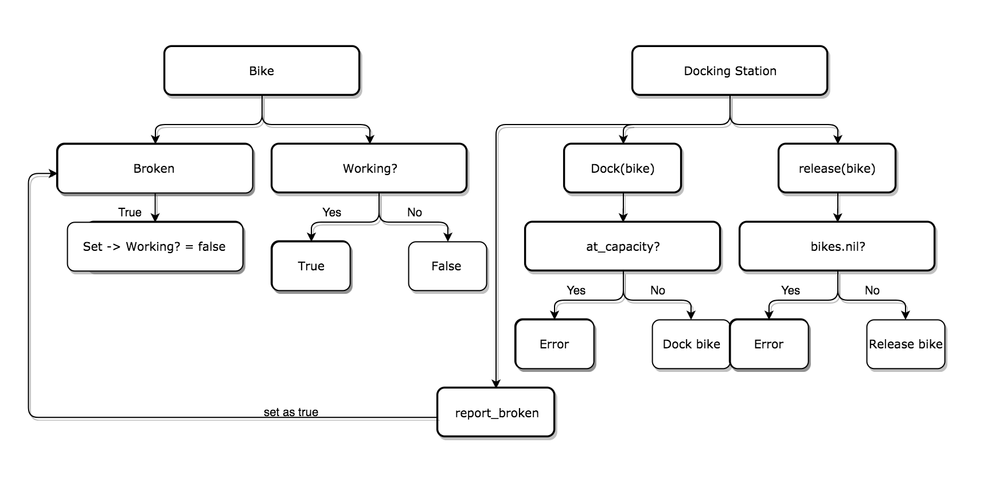

## Boris Bikes CHALLENGES

This is the first project made at the Makers Academy course, We are supposed to build a program that will emulate all the docking stations, bikes, and infrastructure (repair staff, and so on) required to make the Boris Bikes a reality.

It is composed by 22 challenges.
The goal of this projects it is not complete all of them but get knowledge, spending time in researches and learning how to solve problems.

## How to start

Clone the repo and go to the project folder.

to run the tests ```gem install rspec``` then ```rspec``` on the command line.

to run the program run ```pry``` or ```irb```, then ```require "./lib/classes"```

to create a new docking station ```dockingStation = DockingStation.new```, to create a new bike ```bike = Bike.new```

### example of the code working

## The process

All the code was made doing TDD, this was a big challenge since we were just starting to code, as you can see it is really messy, however it was a great learning experience. For this project the approach was the following:

1- Pair programming everyday with a different partner.

2- Read a set of users stories.

3- Make a Domain Model/Diagram/Chart to solve the user stories.

4- TDD.

5- Repeat.

## User Stories

|    Objects    |    Messages   |
| ------------- |:-------------:|
| Person        |               |
| DockingStation|release_bike   |
| Bike          | working? |
| Public        |               |
| DockingStation|dock_bike      |
| DockingStation|has_bike?      |
| Bike          | docked?       |


DockingStation <-- release_bike --> a Bike <br />
GoodBike       <--   working?   --> true/false
DockingStation <-- dock_bike --> true/false

## Final Chart


